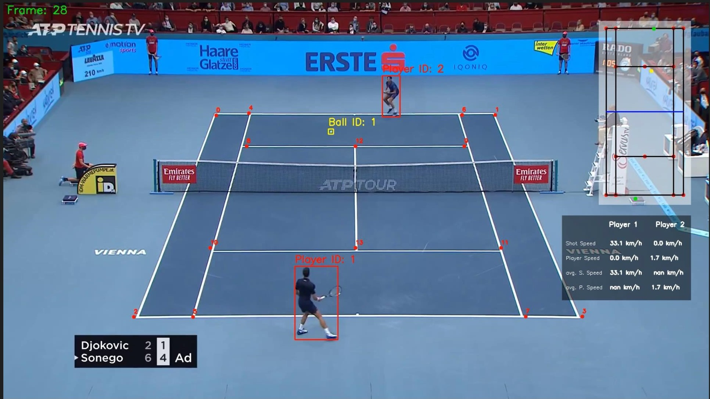

# Tennis Analysis

## Introduction
This project provides an in-depth analysis of tennis players in a video, focusing on measuring their speed, ball shot speed, and the number of shots. The analysis involves detecting players and the tennis ball using YOLO models and extracting key points of the tennis court using a ResNet50 model. The project offers a practical approach to refining your machine learning and computer vision skills.

## Key Features
- **Player Detection**: YOLOv8 is used to detect players in the video. The two main players are identified based on their proximity to key points on the court.
- **Court Keypoint Detection**: A ResNet50 model, trained on a keypoint dataset, is used to detect 14 key points on the tennis court.
- **Tennis Ball Detection**: A fine-tuned YOLOv5 model, trained on the RoboFlow tennis dataset, is used to continuously detect the tennis ball throughout the video.
- **Player and Ball Tracking**: The project includes tracking players and interpolating the ball's position across frames using the pandas library. 
- **Mini Court Creation**: A miniature version of the tennis court is created using the real dimensions of the court. This mini court is used to track the movement of players and the ball.
- **Speed and Ball Hit Analysis**: Player speed is calculated by analyzing the pixel change rate. The ball hit count is determined by tracking changes in the ball's direction, allowing for the identification of ball-hit frames.

## Output Videos
Below is a screenshot from one of the output videos showing the detected players, ball, and mini court:

## Models Used
- **YOLOv8**: Used for detecting players and identifying the main players based on proximity to court key points.
- **ResNet50**: Trained to detect 14 key points on the tennis court.
- **YOLOv5**: Fine-tuned to detect the tennis ball, trained on the RoboFlow tennis dataset.

## Training
- **Tennis Ball Detector with YOLOv5**: [training/tennis_ball_detector_training.ipynb](training/tennis_ball_detector_training.ipynb)
- **Tennis Court Keypoint Detection with ResNet50**: [training/tennis_court_keypoints_training.ipynb](training/tennis_court_keypoints_training.ipynb)

## Requirements
- Python 3.11
- Ultralytics
- PyTorch
- Pandas
- Numpy
- OpenCV-python

## Analysis Workflow
1. **Player Detection**: YOLOv8 is used to detect players, and the two main players are identified based on their proximity to court key points.
2. **Court Keypoint Detection**: 14 key points on the court are detected using the ResNet50 model.
3. **Ball Detection**: The YOLOv5 model is used to continuously detect the ball in the video.
4. **Mini Court Creation**: A mini court is created based on real court dimensions, enabling accurate player and ball tracking.
5. **Player and Ball Speed Calculation**: Player speed is calculated based on the rate of pixel change, and the ball hit count is determined by analyzing changes in the ball's direction.
